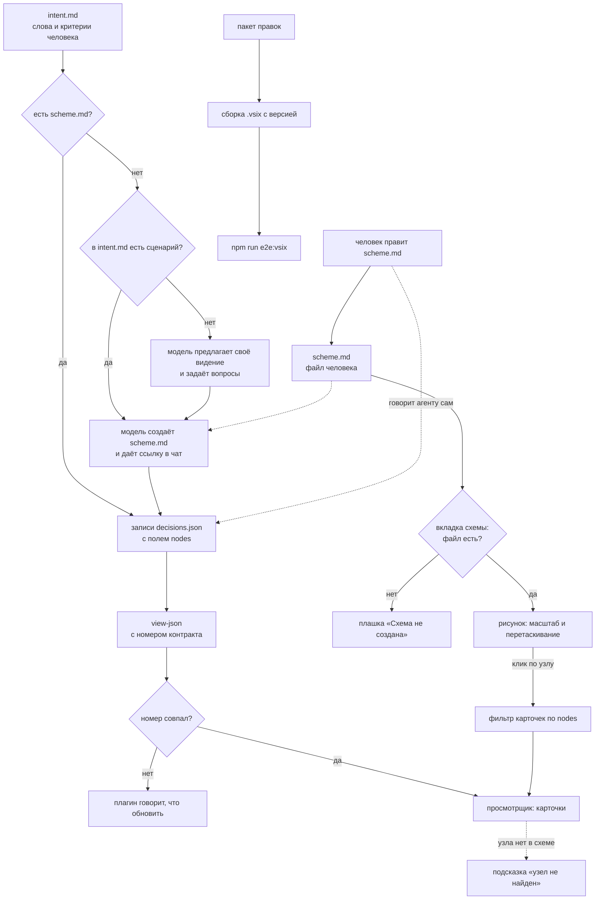

# Схема решения: decision-scheme

Как понял модель: сценария в `intent.md` нет, он собран из критериев готовности. Файл твой, правь как удобно.

```mermaid
flowchart TD
    intent["intent.md<br/>слова и критерии человека"] --> exists{"есть scheme.md?"}
    exists -- "нет" --> scenario{"в intent.md есть сценарий?"}
    scenario -- "да" --> create["модель создаёт scheme.md<br/>и даёт ссылку в чат"]
    scenario -- "нет" --> ask["модель предлагает своё видение<br/>и задаёт вопросы"]
    ask --> create
    exists -- "да" --> journal
    create --> journal["записи decisions.json<br/>с полем nodes"]
    file["scheme.md<br/>файл человека"] -.-> create
    human["человек правит scheme.md"] --> file
    human -. "говорит агенту сам" .-> journal

    journal --> viewjson["view-json<br/>с номером контракта"]
    viewjson --> number{"номер совпал?"}
    number -- "нет" --> update["плагин говорит, что обновить"]
    number -- "да" --> cards["просмотрщик: карточки"]

    file --> tab{"вкладка схемы:<br/>файл есть?"}
    tab -- "нет" --> plate["плашка «Схема не создана»"]
    tab -- "да" --> picture["рисунок: масштаб и перетаскивание"]
    picture -- "клик по узлу" --> filter["фильтр карточек по nodes"]
    filter --> cards
    cards -. "узла нет в схеме" .-> hint["подсказка «узел не найден»"]

    package["пакет правок"] --> vsix["сборка .vsix с версией"]
    vsix --> check["npm run e2e:vsix"]
```
