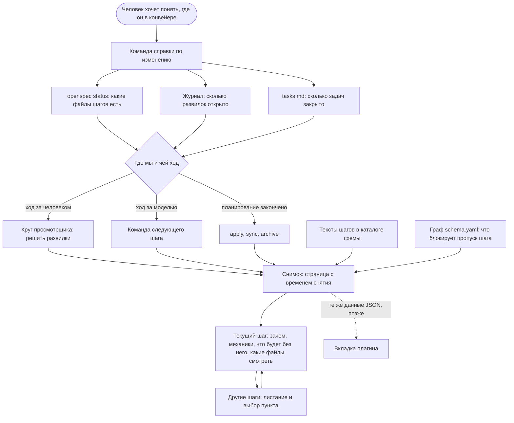

# Схема решения: step-help

```mermaid
flowchart TD
  person([Человек хочет понять, где он в конвейере]) --> cmd[Команда справки по изменению]
  cmd --> status[openspec status: какие файлы шагов есть]
  cmd --> journal[Журнал: сколько развилок открыто]
  cmd --> tasks[tasks.md: сколько задач закрыто]
  status --> where{Где мы и чей ход}
  journal --> where
  tasks --> where
  where -->|ход за человеком| human[Круг просмотрщика: решить развилки]
  where -->|ход за моделью| model[Команда следующего шага]
  where -->|планирование закончено| after[apply, sync, archive]
  human --> page
  model --> page
  after --> page
  texts[Тексты шагов в каталоге схемы] --> page[Снимок: страница с временем снятия]
  deps[Граф schema.yaml: что блокирует пропуск шага] --> page
  page --> current[Текущий шаг: зачем, механики, что будет без него, какие файлы смотреть]
  current --> others[Другие шаги: листание и выбор пункта]
  others --> current
  page -.->|те же данные JSON, позже| plugin[Вкладка плагина]
```
