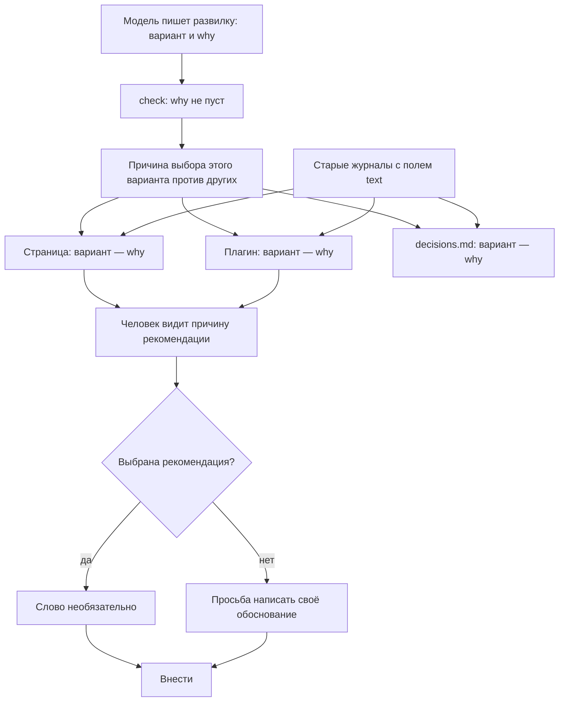

# Схема решения: recommendation-why

```mermaid
flowchart TD
    model["Модель пишет развилку: вариант и why"] --> check["check: why не пуст"]
    check --> why["Причина выбора этого варианта против других"]
    why --> page["Страница: вариант — why"]
    why --> plugin["Плагин: вариант — why"]
    why --> md["decisions.md: вариант — why"]
    old["Старые журналы с полем text"] --> page
    old --> plugin
    old --> md
    page --> human["Человек видит причину рекомендации"]
    plugin --> human
    human --> pick{"Выбрана рекомендация?"}
    pick -- да --> noword["Слово необязательно"]
    pick -- нет --> word["Просьба написать своё обоснование"]
    noword --> apply["Внести"]
    word --> apply
```
