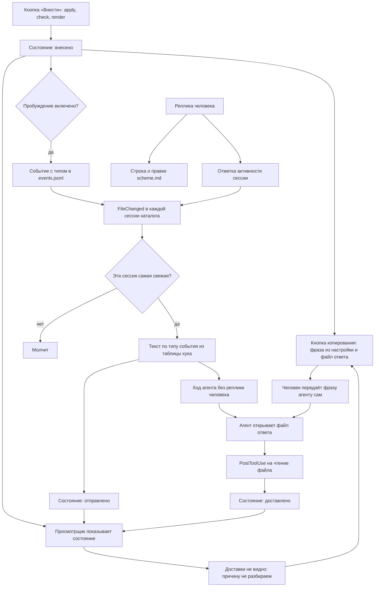

# Схема решения: reverse-hook

```mermaid
flowchart TD
    apply["Кнопка «Внести»: apply, check, render"] --> entered["Состояние: внесено"]
    entered --> copy["Кнопка копирования: фраза из настройки и файл ответа"]
    copy --> human["Человек передаёт фразу агенту сам"]
    entered --> wakeOn{"Пробуждение включено?"}
    wakeOn -- да --> event["Событие с типом в events.jsonl"]
    event --> fileHook["FileChanged в каждой сессии каталога"]
    prompt["Реплика человека"] --> mark["Отметка активности сессии"]
    prompt --> schemeLine["Строка о правке scheme.md"]
    mark --> fileHook
    fileHook --> newest{"Эта сессия самая свежая?"}
    newest -- нет --> silent["Молчит"]
    newest -- да --> table["Текст по типу события из таблицы хука"]
    table --> sent["Состояние: отправлено"]
    table --> turn["Ход агента без реплики человека"]
    turn --> open["Агент открывает файл ответа"]
    human --> open
    open --> toolHook["PostToolUse на чтение файла"]
    toolHook --> delivered["Состояние: доставлено"]
    entered --> viewer["Просмотрщик показывает состояние"]
    sent --> viewer
    delivered --> viewer
    viewer --> unseen["Доставки не видно: причину не разбираем"]
    unseen --> copy
```
