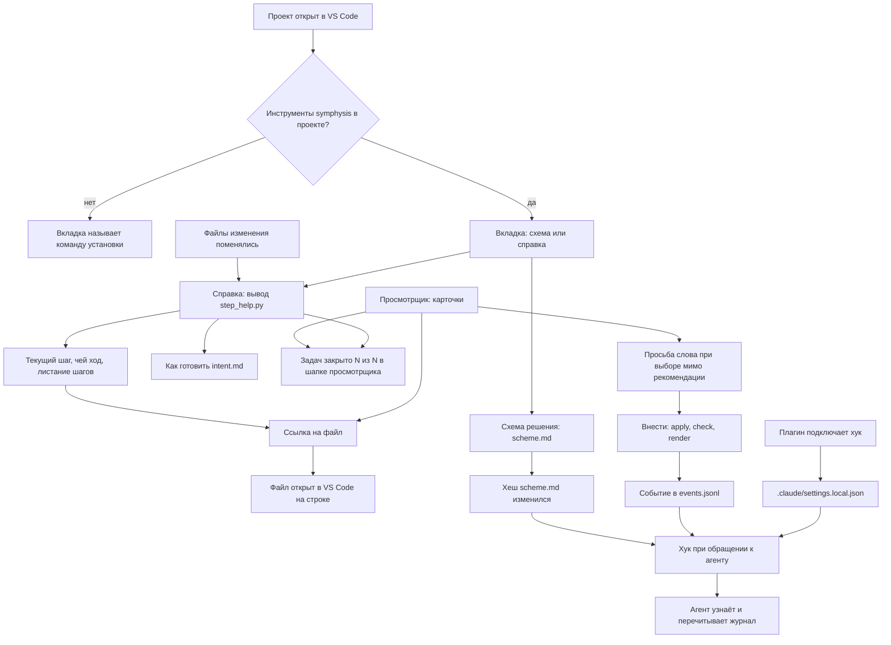

# Схема решения: step-help-tab

```mermaid
flowchart TD
    project["Проект открыт в VS Code"] --> installed{"Инструменты symphysis в проекте?"}
    installed -- нет --> noTools["Вкладка называет команду установки"]
    installed -- да --> tab["Вкладка: схема или справка"]
    tab --> schemeView["Схема решения: scheme.md"]
    tab --> help["Справка: вывод step_help.py"]
    changed["Файлы изменения поменялись"] --> help
    help --> steps["Текущий шаг, чей ход, листание шагов"]
    help --> howto["Как готовить intent.md"]
    help --> counter["Задач закрыто N из N в шапке просмотрщика"]
    viewer["Просмотрщик: карточки"] --> counter
    viewer --> word["Просьба слова при выборе мимо рекомендации"]
    viewer --> links["Ссылка на файл"]
    steps --> links
    links --> openFile["Файл открыт в VS Code на строке"]
    word --> apply["Внести: apply, check, render"]
    apply --> event["Событие в events.jsonl"]
    connect["Плагин подключает хук"] --> settings[".claude/settings.local.json"]
    settings --> hook["Хук при обращении к агенту"]
    event --> hook
    schemeView --> schemeHash["Хеш scheme.md изменился"]
    schemeHash --> hook
    hook --> agent["Агент узнаёт и перечитывает журнал"]
```
