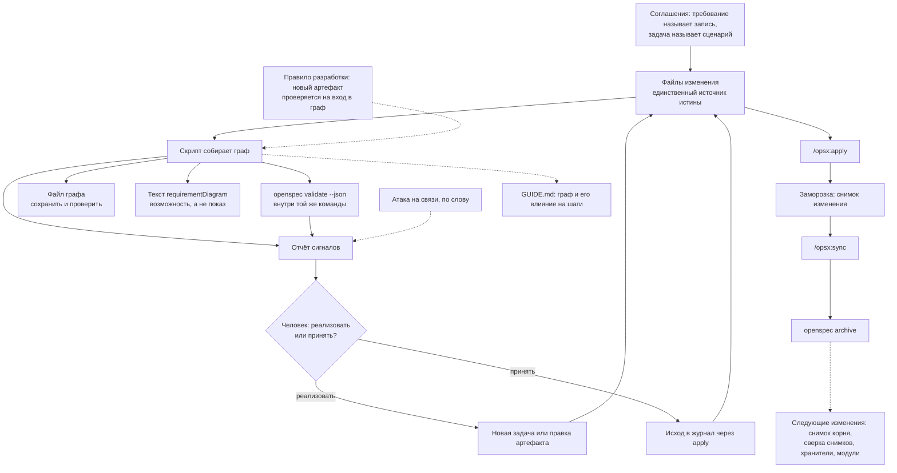

# Схема решения: trace-graph

```mermaid
flowchart TD
    conv["Соглашения: требование называет запись,<br/>задача называет сценарий"] --> files["Файлы изменения<br/>единственный источник истины"]
    files --> collect["Скрипт собирает граф"]
    rule["Правило разработки: новый артефакт<br/>проверяется на вход в граф"] -.-> collect
    collect --> validate["openspec validate --json<br/>внутри той же команды"]
    collect --> save["Файл графа<br/>сохранить и проверить"]
    collect --> diagram["Текст requirementDiagram<br/>возможность, а не показ"]
    collect --> report["Отчёт сигналов"]
    validate --> report
    attack["Атака на связи, по слову"] -.-> report
    report --> human{"Человек: реализовать<br/>или принять?"}
    human -- реализовать --> tasks["Новая задача или правка артефакта"]
    human -- принять --> outcome["Исход в журнал через apply"]
    tasks --> files
    outcome --> files
    files --> apply["/opsx:apply"]
    apply --> freeze["Заморозка: снимок изменения"]
    freeze --> sync["/opsx:sync"]
    sync --> archive["openspec archive"]
    archive -.-> later["Следующие изменения: снимок корня,<br/>сверка снимков, хранители, модули"]
    collect -.-> guide["GUIDE.md: граф и его влияние на шаги"]
```
