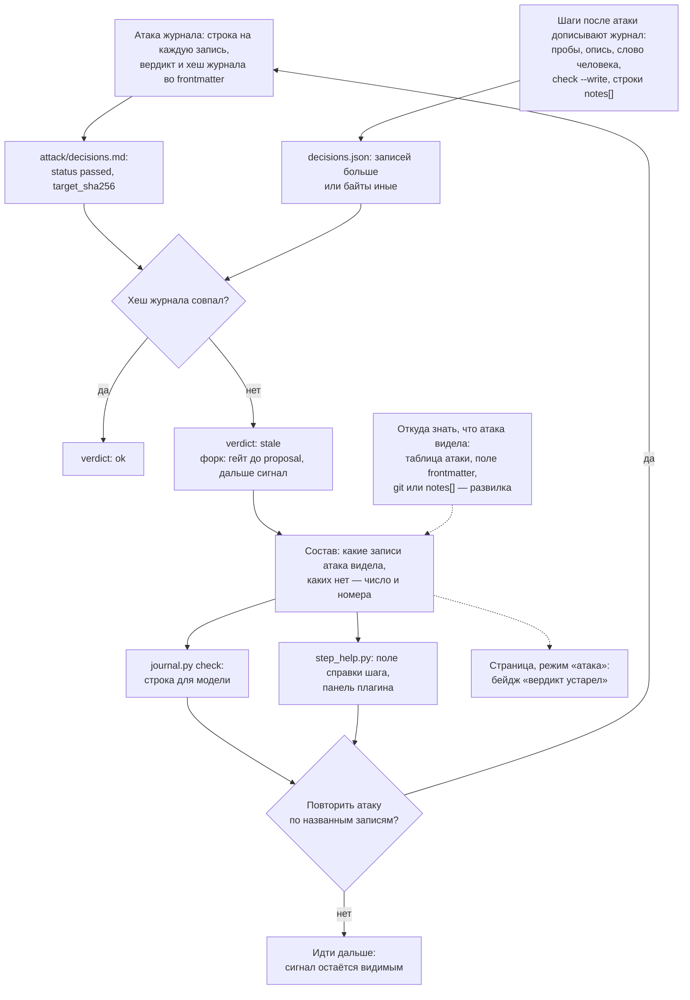

# Схема решения: attack-stale-scope

```mermaid
flowchart TD
    attack["Атака журнала: строка на каждую запись,<br/>вердикт и хеш журнала во frontmatter"] --> verdict["attack/decisions.md:<br/>status passed, target_sha256"]
    later["Шаги после атаки дописывают журнал:<br/>пробы, опись, слово человека,<br/>check --write, строки notes[]"] --> journal["decisions.json: записей больше<br/>или байты иные"]
    verdict --> cmp{"Хеш журнала совпал?"}
    journal --> cmp
    cmp -- да --> ok["verdict: ok"]
    cmp -- нет --> stale["verdict: stale<br/>форк: гейт до proposal, дальше сигнал"]
    stale --> scope["Состав: какие записи атака видела,<br/>каких нет — число и номера"]
    source["Откуда знать, что атака видела:<br/>таблица атаки, поле frontmatter,<br/>git или notes[] — развилка"] -.-> scope
    scope --> check["journal.py check:<br/>строка для модели"]
    scope --> help["step_help.py: поле справки шага,<br/>панель плагина"]
    scope -.-> page["Страница, режим «атака»:<br/>бейдж «вердикт устарел»"]
    check --> human{"Повторить атаку<br/>по названным записям?"}
    help --> human
    human -- да --> attack
    human -- нет --> next["Идти дальше:<br/>сигнал остаётся видимым"]
```
