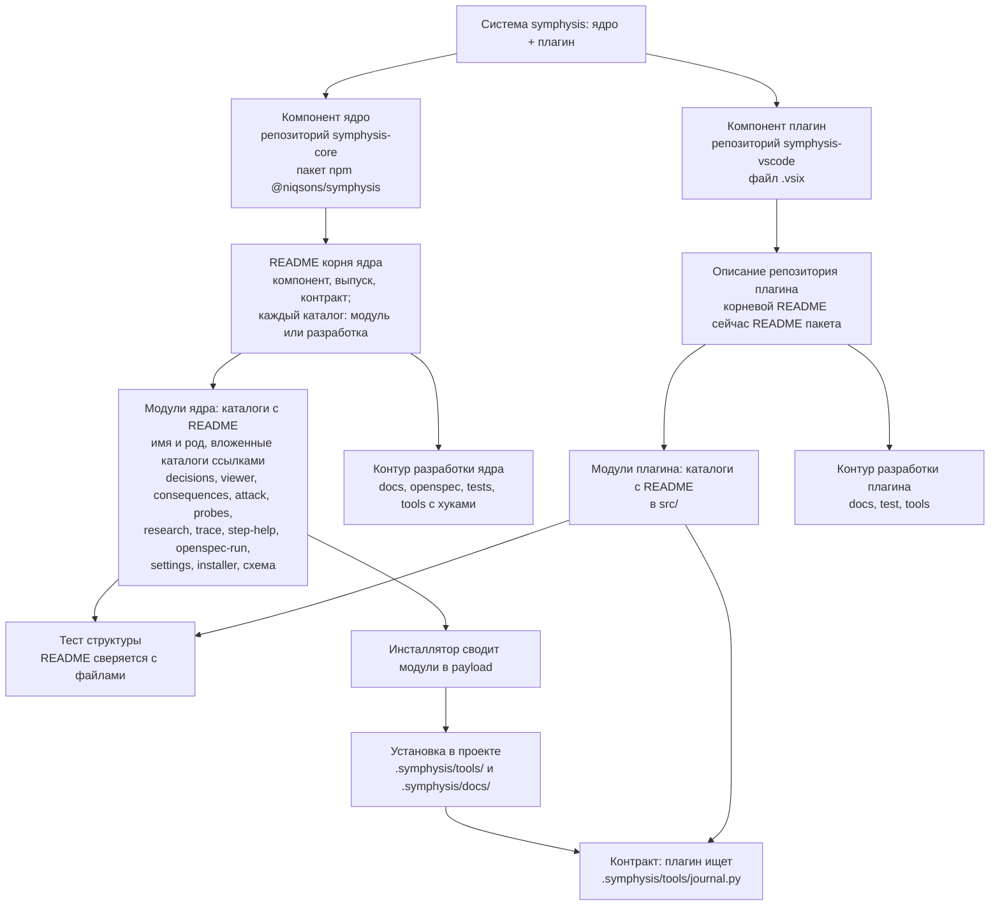

# Схема раскладки: module-structure

```mermaid
flowchart TD
    sys["Система symphysis: ядро + плагин"]
    sys --> core["Компонент ядро<br/>репозиторий symphysis-core<br/>пакет npm @niqsons/symphysis"]
    sys --> plug["Компонент плагин<br/>репозиторий symphysis-vscode<br/>файл .vsix"]
    core --> coreReadme["README корня ядра<br/>компонент, выпуск, контракт;<br/>каждый каталог: модуль или разработка"]
    coreReadme --> coreMods["Модули ядра: каталоги с README<br/>имя и род, вложенные каталоги ссылками<br/>decisions, viewer, consequences, attack, probes,<br/>research, trace, step-help, openspec-run,<br/>settings, installer, схема"]
    coreReadme --> coreDev["Контур разработки ядра<br/>docs, openspec, tests, tools с хуками"]
    plug --> plugReadme["Описание репозитория плагина<br/>корневой README сейчас README пакета"]
    plugReadme --> plugMods["Модули плагина: каталоги с README<br/>в src/"]
    plugReadme --> plugDev["Контур разработки плагина<br/>docs, test, tools"]
    coreMods --> check["Тест структуры<br/>README сверяется с файлами"]
    plugMods --> check
    coreMods --> payload["Инсталлятор сводит модули в payload"]
    payload --> install["Установка в проекте<br/>.symphysis/tools/ и .symphysis/docs/"]
    install --> contract["Контракт: плагин ищет<br/>.symphysis/tools/journal.py"]
    plugMods --> contract
```
