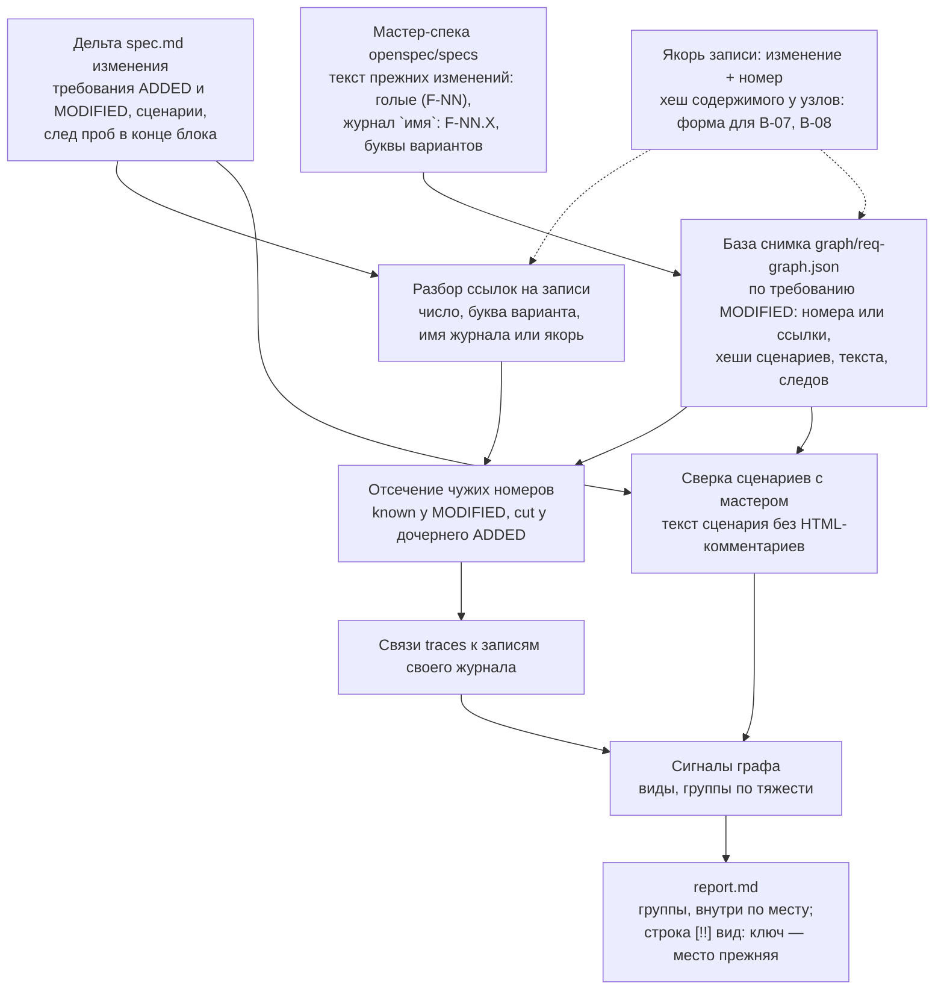

# Схема решения: trace-numbers-signals

```mermaid
flowchart TD
    spec["Дельта spec.md изменения<br/>требования ADDED и MODIFIED, сценарии,<br/>след проб в конце блока"]
    master["Мастер-спека openspec/specs<br/>текст прежних изменений: голые (F-NN),<br/>журнал `имя`: F-NN.X, буквы вариантов"]
    base["База снимка graph/req-graph.json<br/>по требованию MODIFIED: номера или ссылки,<br/>хеши сценариев, текста, следов"]
    refs["Разбор ссылок на записи<br/>число, буква варианта, имя журнала или якорь"]
    cut["Отсечение чужих номеров<br/>known у MODIFIED, cut у дочернего ADDED"]
    links["Связи traces к записям своего журнала"]
    scn["Сверка сценариев с мастером<br/>текст сценария без HTML-комментариев"]
    signals["Сигналы графа<br/>виды, группы по тяжести"]
    report["report.md<br/>группы, внутри по месту;<br/>строка [!!] вид: ключ — место прежняя"]
    anchor["Якорь записи: изменение + номер<br/>хеш содержимого у узлов: форма для B-07, B-08"]
    spec --> refs
    master --> base
    base --> cut
    refs --> cut
    cut --> links
    spec --> scn
    base --> scn
    links --> signals
    scn --> signals
    signals --> report
    anchor -.-> refs
    anchor -.-> base
```
