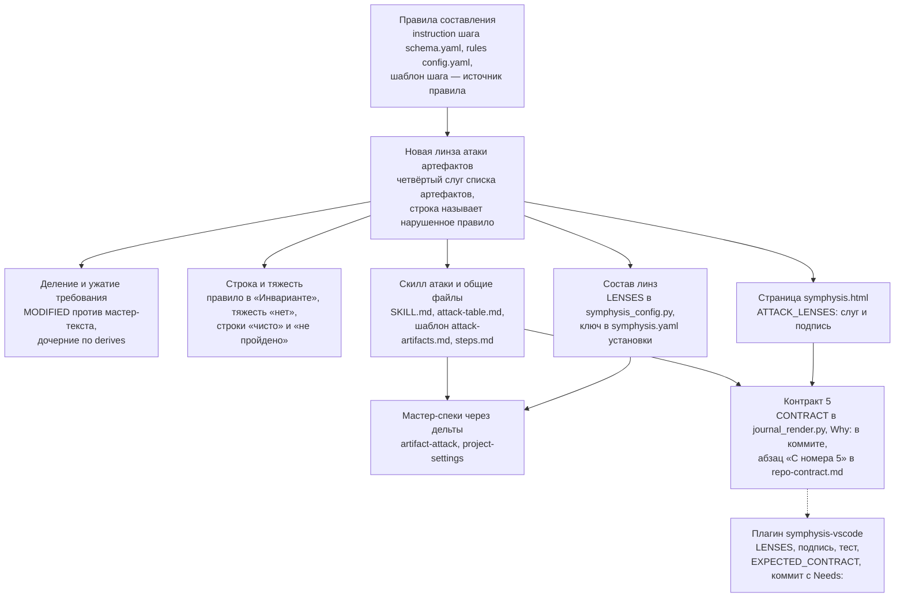

# Схема решения: attack-lens-conventions

```mermaid
flowchart TD
    rules["Правила составления<br/>instruction шага schema.yaml, rules config.yaml,<br/>шаблон шага — источник правила"]
    lens["Новая линза атаки артефактов<br/>четвёртый слуг списка артефактов,<br/>строка называет нарушенное правило"]
    split["Деление и ужатие требования<br/>MODIFIED против мастер-текста,<br/>дочерние по derives"]
    row["Строка и тяжесть<br/>правило в «Инварианте», тяжесть «нет»,<br/>строки «чисто» и «не пройдено»"]
    skill["Скилл атаки и общие файлы<br/>SKILL.md, attack-table.md,<br/>шаблон attack-artifacts.md, steps.md"]
    settings["Состав линз<br/>LENSES в symphysis_config.py,<br/>ключ в symphysis.yaml установки"]
    page["Страница symphysis.html<br/>ATTACK_LENSES: слуг и подпись"]
    specs["Мастер-спеки через дельты<br/>artifact-attack, project-settings"]
    contract["Контракт 5<br/>CONTRACT в journal_render.py, Why: в коммите,<br/>абзац «С номера 5» в repo-contract.md"]
    plugin["Плагин symphysis-vscode<br/>LENSES, подпись, тест,<br/>EXPECTED_CONTRACT, коммит с Needs:"]
    rules --> lens
    lens --> split
    lens --> row
    lens --> skill
    lens --> settings
    lens --> page
    skill --> specs
    settings --> specs
    skill --> contract
    page --> contract
    contract -.-> plugin
```
