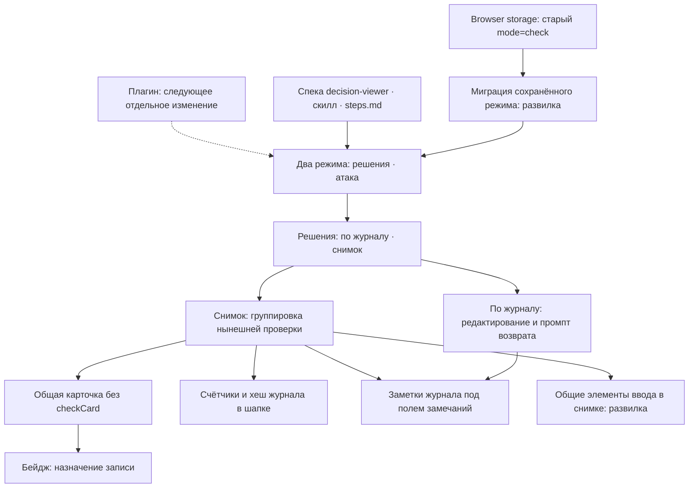

# Схема решения

```mermaid
flowchart TD
  modes["Два режима: решения · атака"] --> layouts["Решения: по журналу · снимок"]
  layouts --> journal["По журналу: редактирование и промпт возврата"]
  layouts --> snapshot["Снимок: группировка нынешней проверки"]
  snapshot --> card["Общая карточка без checkCard"]
  card --> destination["Бейдж: назначение записи"]
  snapshot --> header["Счётчики и хеш журнала в шапке"]
  journal --> notes["Заметки журнала под полем замечаний"]
  snapshot --> notes
  storage["Browser storage: старый mode=check"] --> migration["Миграция сохранённого режима: развилка"]
  migration --> modes
  snapshot --> panels["Общие элементы ввода в снимке: развилка"]
  docs["Спека decision-viewer · скилл · steps.md"] --> modes
  plugin["Плагин: следующее отдельное изменение"] -.-> modes
```
