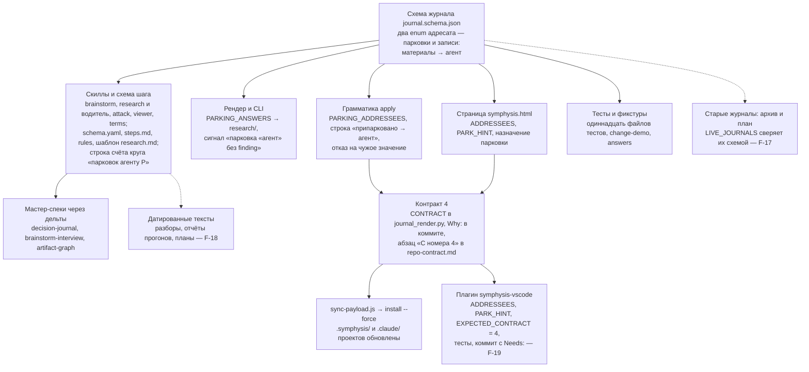

# Схема решения: parking-addressee-agent

```mermaid
flowchart TD
    enum["Схема журнала journal.schema.json<br/>два enum адресата — парковки и записи:<br/>материалы → агент"]
    apply["Грамматика apply<br/>PARKING_ADDRESSEES, строка «припарковано → агент»,<br/>отказ на чужое значение"]
    render["Рендер и CLI<br/>PARKING_ANSWERS → research/,<br/>сигнал «парковка «агент» без finding»"]
    page["Страница symphysis.html<br/>ADDRESSEES, PARK_HINT, назначение парковки"]
    skills["Скиллы и схема шага<br/>brainstorm, research и водитель, attack, viewer, terms;<br/>schema.yaml, steps.md, rules, шаблон research.md;<br/>строка счёта круга «парковок агенту P»"]
    specs["Мастер-спеки через дельты<br/>decision-journal, brainstorm-interview, artifact-graph"]
    tests["Тесты и фикстуры<br/>одиннадцать файлов тестов, change-demo, answers"]
    legacy["Старые журналы: архив и план<br/>LIVE_JOURNALS сверяет их схемой — F-17"]
    texts["Датированные тексты<br/>разборы, отчёты прогонов, планы — F-18"]
    contract["Контракт 4<br/>CONTRACT в journal_render.py, Why: в коммите,<br/>абзац «С номера 4» в repo-contract.md"]
    payload["sync-payload.js → install --force<br/>.symphysis/ и .claude/ проектов обновлены"]
    plugin["Плагин symphysis-vscode<br/>ADDRESSEES, PARK_HINT, EXPECTED_CONTRACT = 4,<br/>тесты, коммит с Needs: — F-19"]
    enum --> apply
    enum --> render
    enum --> page
    enum --> skills
    skills --> specs
    enum --> tests
    enum -.-> legacy
    skills -.-> texts
    apply --> contract
    page --> contract
    contract --> payload
    contract --> plugin
```
