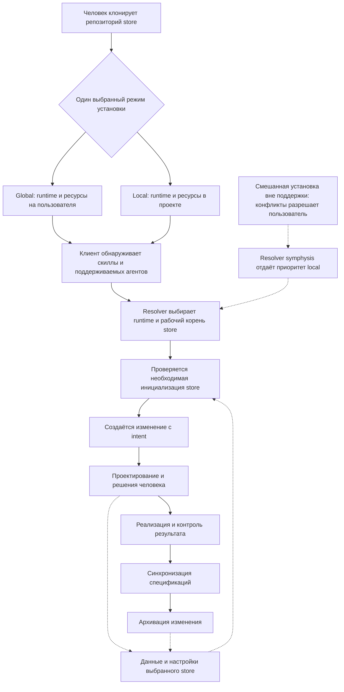

```mermaid
flowchart TD
    C[Человек клонирует репозиторий store] --> M{Один выбранный режим установки}
    M --> G[Global: runtime и ресурсы на пользователя]
    M --> L[Local: runtime и ресурсы в проекте]
    G --> K[Клиент обнаруживает скиллы и поддерживаемых агентов]
    L --> K
    K --> P[Resolver выбирает runtime и рабочий корень store]
    P --> I[Проверяется необходимая инициализация store]
    I --> N[Создаётся изменение с intent]
    N --> D[Проектирование и решения человека]
    D --> V[Реализация и контроль результата]
    V --> S[Синхронизация спецификаций]
    S --> A[Архивация изменения]
    T[Данные и настройки выбранного store] -.-> I
    D -.-> T
    A -.-> T
    X[Смешанная установка вне поддержки: конфликты разрешает пользователь] -.-> R[Resolver symphysis отдаёт приоритет local]
    R -.-> P
```
