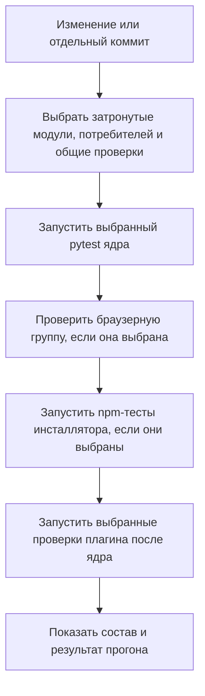

# Схема решения

```mermaid
flowchart TD
    DIFF["Изменение или отдельный коммит"] --> SELECT["Выбрать затронутые модули, потребителей и общие проверки"]
    SELECT --> CORE["Запустить выбранный pytest ядра"]
    CORE --> BROWSER["Проверить браузерную группу, если она выбрана"]
    BROWSER --> INSTALLER["Запустить npm-тесты инсталлятора, если они выбраны"]
    INSTALLER --> PLUGIN["Запустить выбранные проверки плагина после ядра"]
    PLUGIN --> RESULT["Показать состав и результат прогона"]
```
