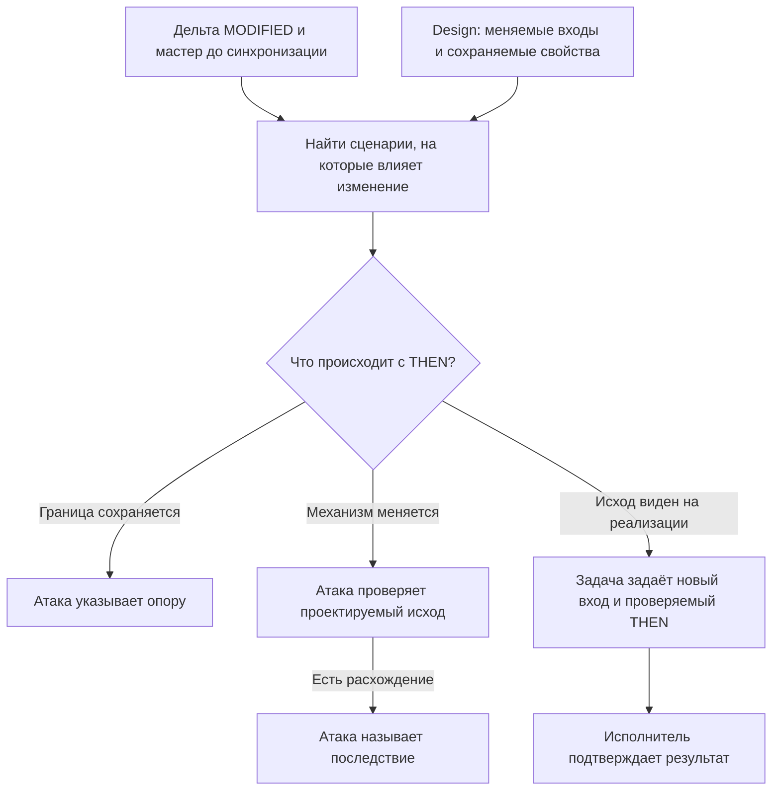

```mermaid
flowchart TD
    Baseline["Дельта MODIFIED и мастер до синхронизации"] --> Scope["Найти сценарии, на которые влияет изменение"]
    Design["Design: меняемые входы и сохраняемые свойства"] --> Scope
    Scope --> Impact{"Что происходит с THEN?"}
    Impact -->|"Граница сохраняется"| Evidence["Атака указывает опору"]
    Impact -->|"Механизм меняется"| Review["Атака проверяет проектируемый исход"]
    Impact -->|"Исход виден на реализации"| Task["Задача задаёт новый вход и проверяемый THEN"]
    Task --> Apply["Исполнитель подтверждает результат"]
    Review -->|"Есть расхождение"| Finding["Атака называет последствие"]
```
