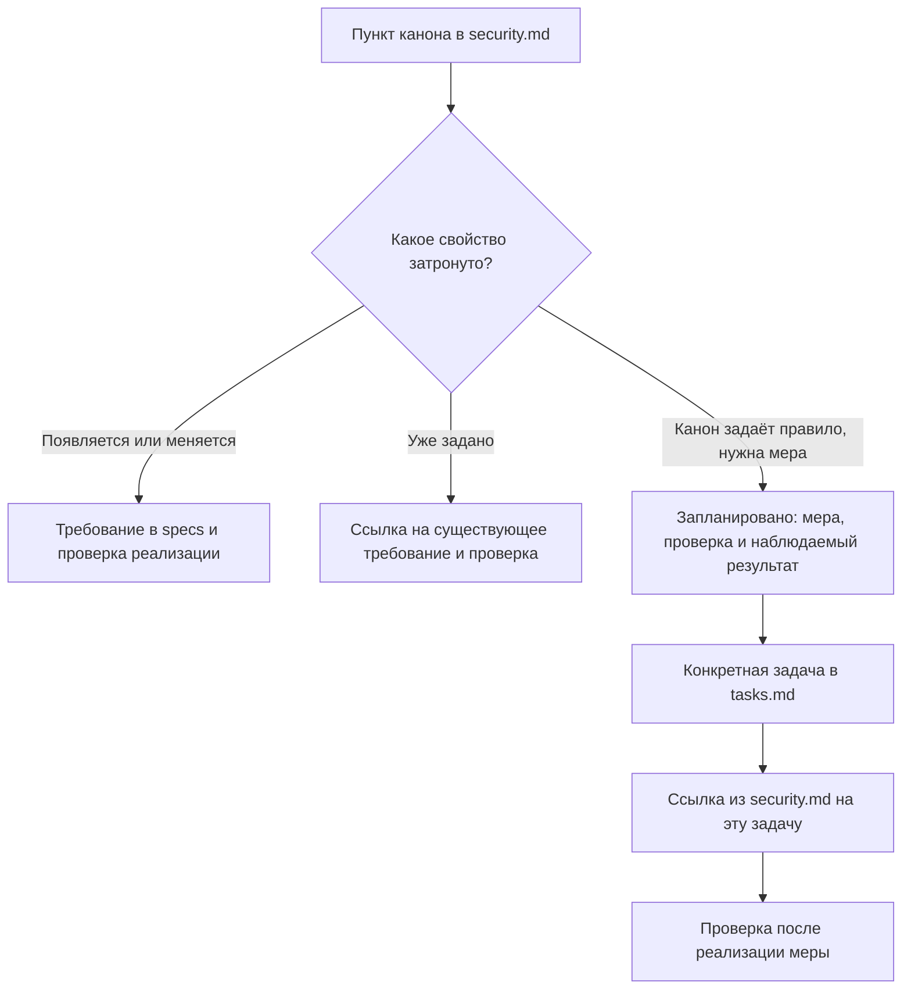

```mermaid
flowchart TD
    C["Пункт канона в security.md"] --> K{"Какое свойство затронуто?"}
    K -->|Появляется или меняется| N["Требование в specs и проверка реализации"]
    K -->|Уже задано| E["Ссылка на существующее требование и проверка"]
    K -->|Канон задаёт правило, нужна мера| P["Запланировано: мера, проверка и наблюдаемый результат"]
    P --> T["Конкретная задача в tasks.md"]
    T --> L["Ссылка из security.md на эту задачу"]
    L --> V["Проверка после реализации меры"]
```
